## POETIZE
POETIZE：作诗，有诗意地描写。

## 网站示例
[poetize.cn](https://poetize.cn)

这是我的个人网站，我的生活倒影，有诗意地记录自己的生活。

## Star
ps: 虽然我知道，大部分人都是来了直接下载源代码后就潇洒的离开。

虽然我知道现实就是如此的残酷，但我还是要以我萤虫之力对各位到来的同仁发出一声诚挚的嘶吼：`Star`，`Star`，`Star`

相信各位同仁看到下面的项目介绍一定会心动的，心想`怎么没有早点遇到这么漂亮的博客项目`。在搭建这个美丽的网站同时，何不`Star`，为这个项目点赞呢！

## 技术栈
前端技术：Vue2（博客系统），Vue3（IM 聊天室系统），Element UI（Vue2），Element-Plus UI（Vue3），Naive UI（Vue3）

后端技术：Java，SpringBoot，MySQL，Mybatis-Plus，t-io，qiniu-java-sdk，spring-boot-starter-mail

## 项目地址
- 博客前端：https://gitee.com/littledokey/poetize-vue2.git
- 聊天室前端：https://gitee.com/littledokey/poetize-im-vue3.git
- 后端：https://gitee.com/littledokey/poetize-server.git
- 博客前端、聊天室前端、后端汇总版（上述三个仓库放在一个仓库里，代码无差别）：https://gitee.com/littledokey/poetize
- 七牛云登录/注册地址（文件服务器/CDN）：https://s.qiniu.com/Mz6Z32
- 网站介绍与更新记录：https://poetize.cn/article/20
- 部署文档和静态资源：https://poetize.cn/article/26

## 网站简介
这是一个 SpringBoot + Vue2 + Vue3 的产物，支持移动端自适应，配有完备的前台和后台管理功能。

网站分两个模块：
- 博客系统：具有文章，表白墙，图片墙，收藏夹，乐曲，视频播放，留言，友链，时间线，后台管理等功能。
- 聊天室系统：具有朋友圈（时间线），好友，群等功能。

本网站采用前后端分离进行实现，两个前端项目通过Nginx代理，后端使用Java。

启动网站需要安装Nginx、Java、MySQL，然后打包前后端项目并部署，详细部署流程请见[部署文档和静态资源：https://poetize.cn/article/26](https://poetize.cn/article/26)。

文件服务可以使用七牛云，也可以使用服务器。默认使用服务器。

Vue3（IM 聊天室系统）是非必须的。如果部署，则需要依赖博客，然后从博客的“联系我”进入，因为登录模块在博客。

## 网站示例（详细示例请见官方网站：[poetize.cn](https://poetize.cn)）
>网站介绍与更新记录请移步：[https://poetize.cn/article/20](https://poetize.cn/article/20)，后续更新将在这里记录与发布。

### 博客

#### 文章速览、文章分类
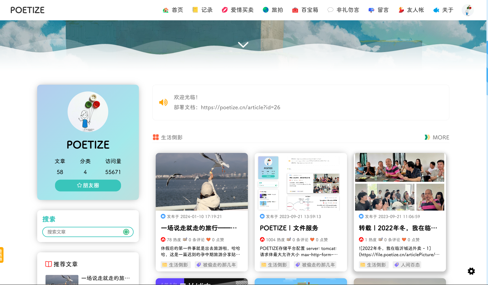

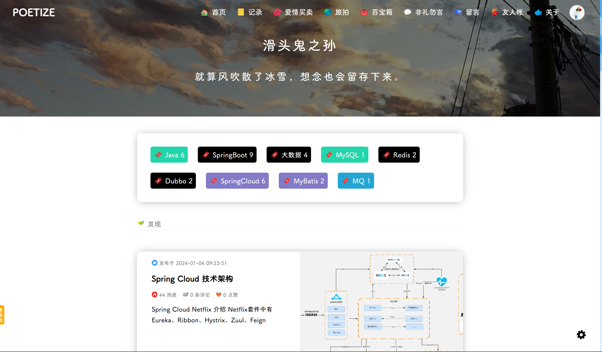

#### 文章详情页：文章、视频功能与留言
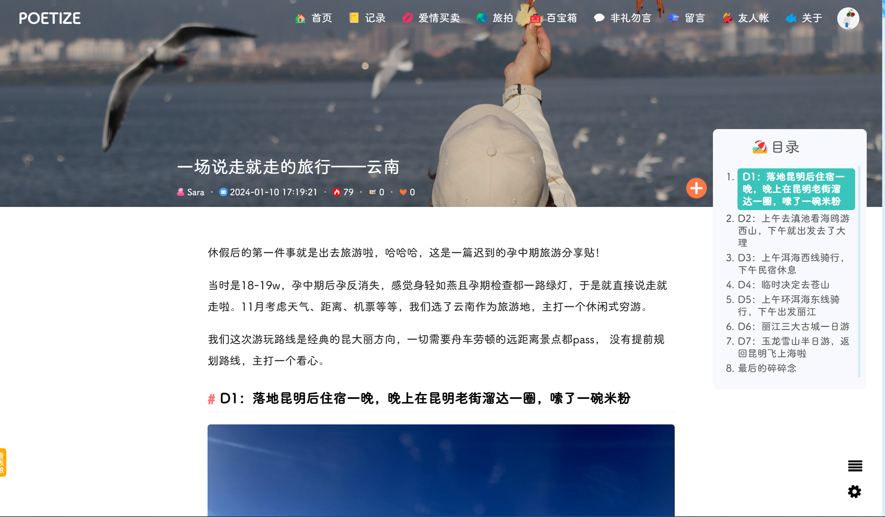

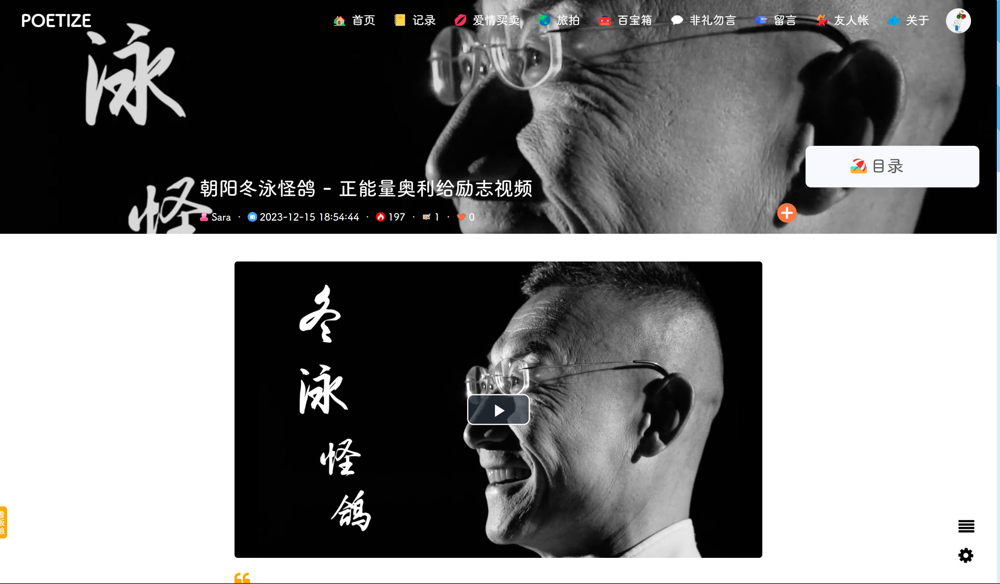

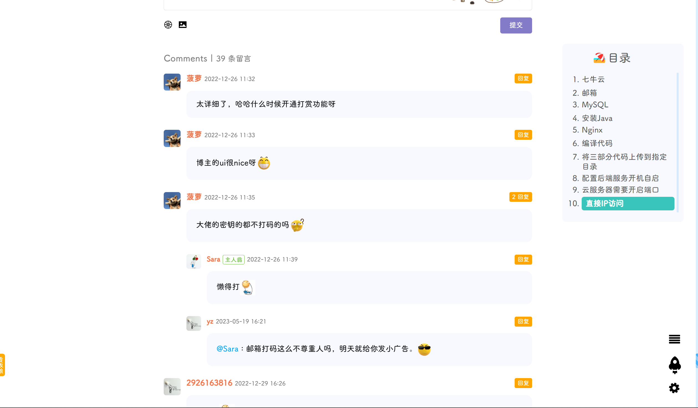

#### 恋爱笔记与旅拍
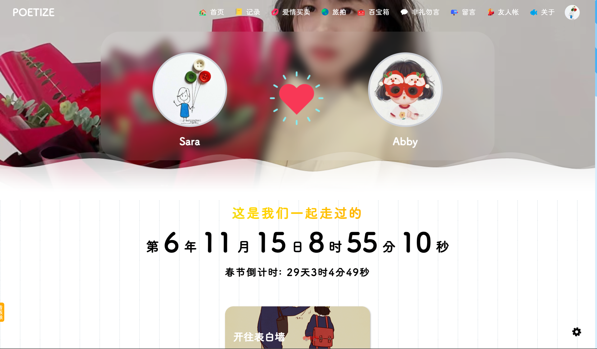

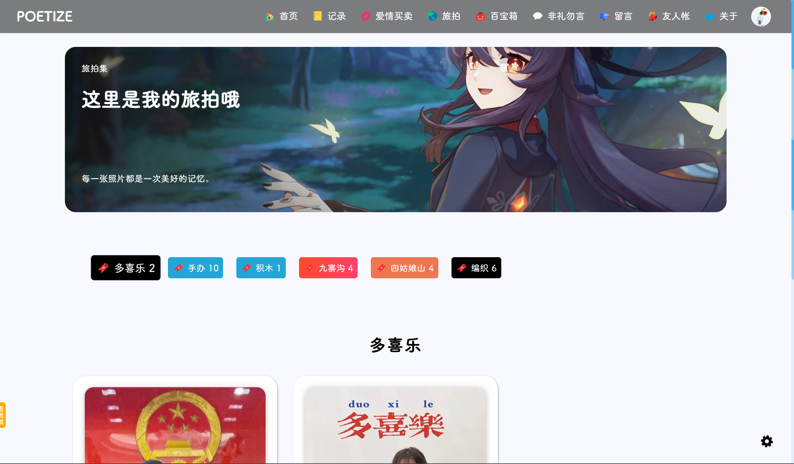

#### 百宝箱、弹幕墙与友人帐
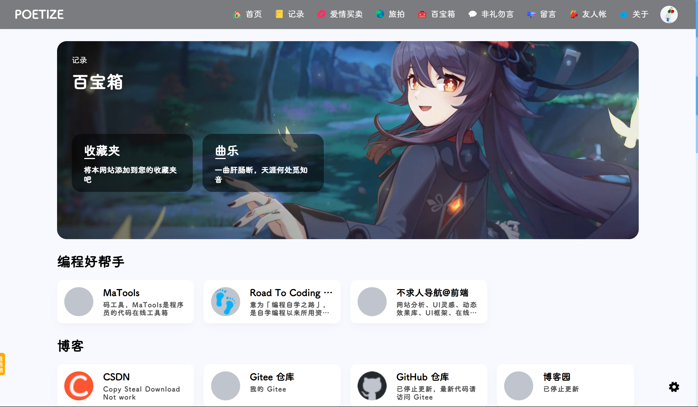

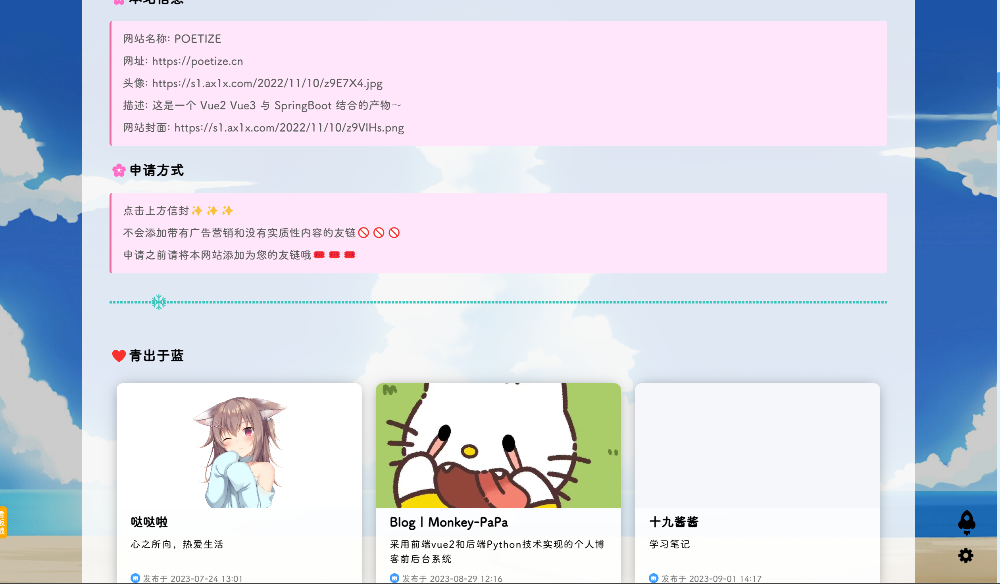

#### 聊天室与朋友圈
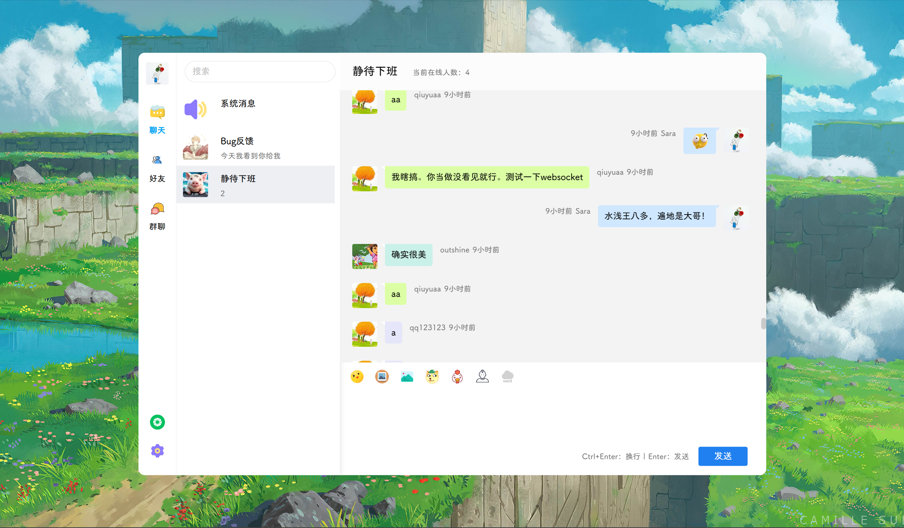

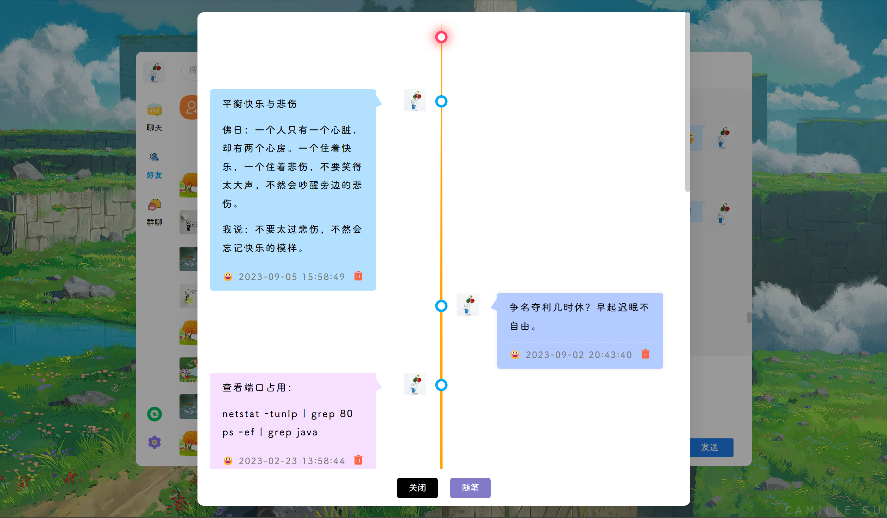

### 后台管理系统

#### 访问统计、基础设置与文件管理
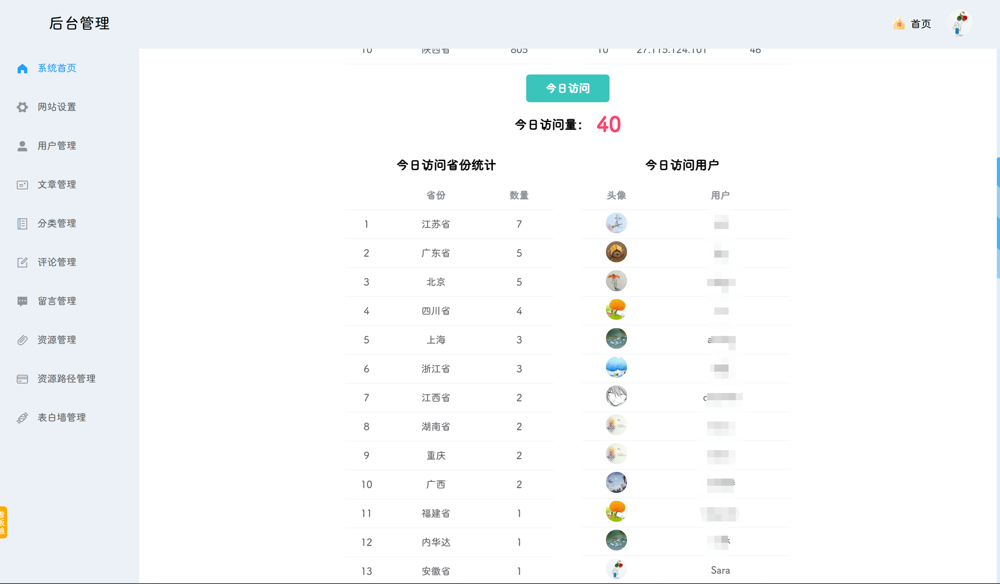

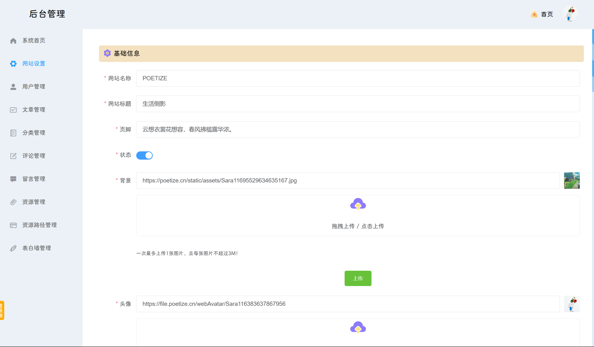

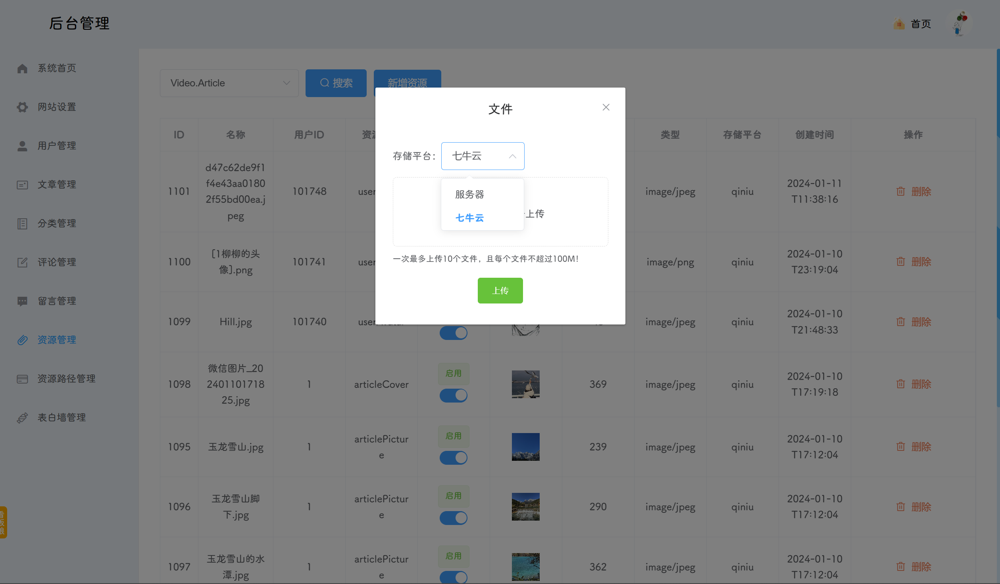

#### 文章管理与新增文章
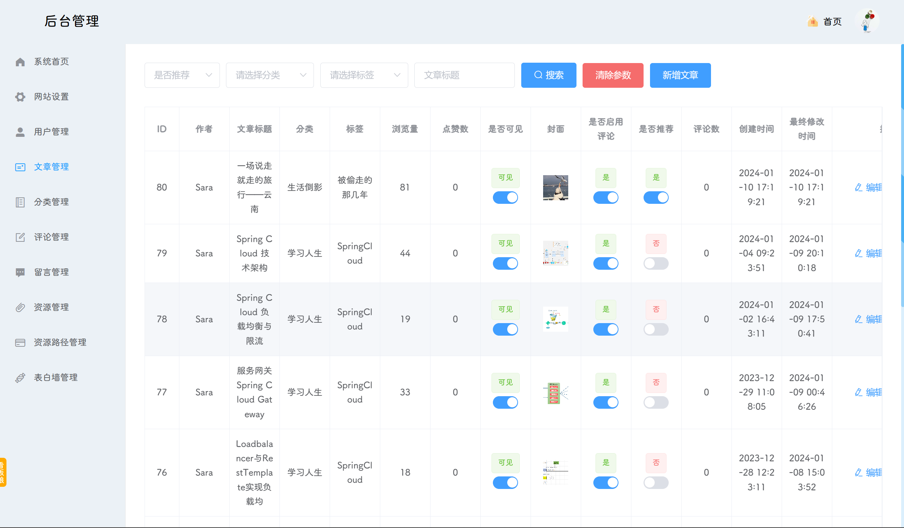

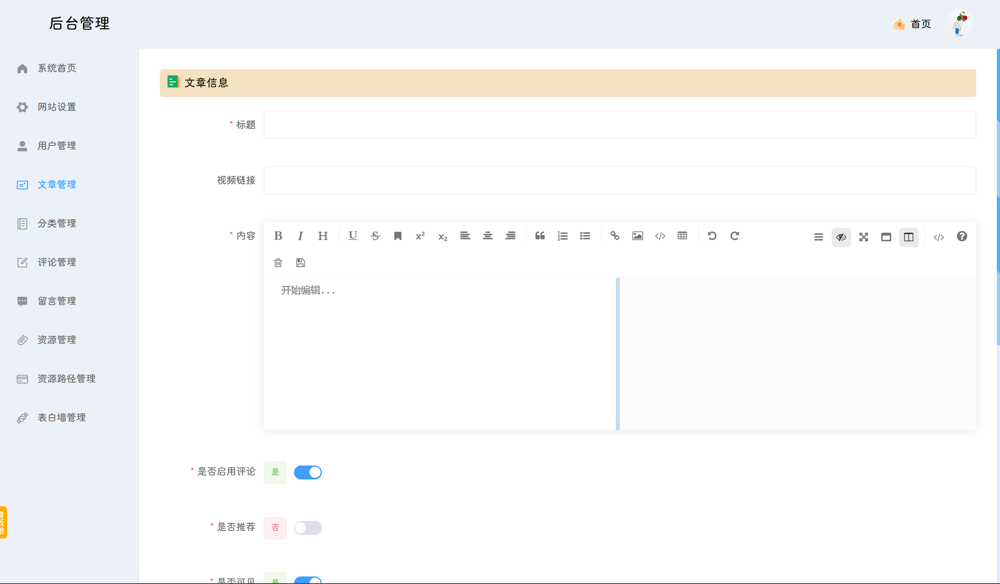

## 更新进度

### 2023年1月1日更新
- 新增：音乐盒功能
- 新增：表白墙功能
- 优化：文件管理
- 优化：登录支持多端登录
- 优化：登录权限过期时间重置
- 优化：前端美化
- 优化：留言分类与资源整合

### 2023年4月1日更新
- 新增：百宝箱（收藏夹）
- 优化：首页
- 优化：前端美化
- 优化：资源整合

### 2023年7月20日更新
- 新增：旅拍模块
- 新增：看板娘
- 优化：聊天室脚本过滤
- 优化：每个IP和账号限制每天接口保存次数
- 优化：Bug修复

### 2023年8月20日更新
- 新增：访客统计（博客首页展示总访问量，后台管理系统首页展示IP/地区/用户维度的访问统计）
- 新增：搜索（标题与内容匹配。标题匹配放在上面，内容匹配放在下面。匹配多个标题或者多个内容时间倒叙排列）
- 新增：音乐按照列表顺序播放，列表中最后一首歌播放完后停止
- 新增：聊天室搜索功能（搜索框下的内容筛选）
- 新增：后台管理系统【欢迎光临】
- 优化：前端美化
- 优化：个别Bug修复

### 2023年9月1日更新：安全，安全，安全
- 优化：所有保存接口、邮件发送接口、文件上传接口都限制次数，防止恶意调用
- 优化：修复vuex中用户信息丢失错乱的Bug
- 优化：文件上传模块改造，每次上传之前获取上传密钥，每个密钥只能上传一个文件
- 优化：个别Bug修复

### 2023年10月1日更新
- 新增：文章加密
- 新增：文章订阅
- 新增：文件上传模块改造，支持多平台（目前对接本地）
- 优化：友人帐及其他模块样式调整

### 2024年1月10日更新
- 新增：首页分类预览
- 新增：文章视频
- 新增：文章目录
- 新增：留言与朋友圈图片放大
- 新增：上传进度条与原始文件名记录
- 优化：百宝箱及其他模块样式调整

### 2024年4月1日更新
- 部署优化，提取配置文件到MySQL，无需编译打包环节
- 前端编译压缩，提升访问速度
- 部分样式美化

### 2024年4月10日更新
- 部署优化
- 后端增加系统配置模块
- 部分样式美化

========================================================================

## 作者微信号：poetize-sara
- 接收付费服务（定制开发、部署）
- 接收毕业设计指导

## 开源不易，欢迎赞助这个项目维持网站运行，您将获得[部署文档和静态资源：https://poetize.cn/article/26](https://poetize.cn/article/26)

## 欢迎关注作者B站
B站搜索用户【寻国记】。

【挑战最美博客！个人博客网站食用教程。这是一个 SpringBoot 与 Vue 的产物，在此公开，一起学习，共同成长。】
https://www.bilibili.com/video/BV1eM41167Ks/?share_source=copy_web
