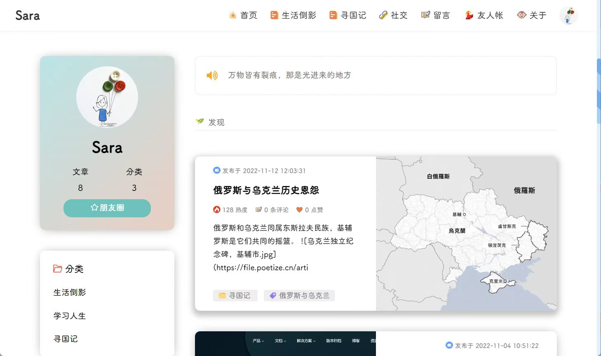
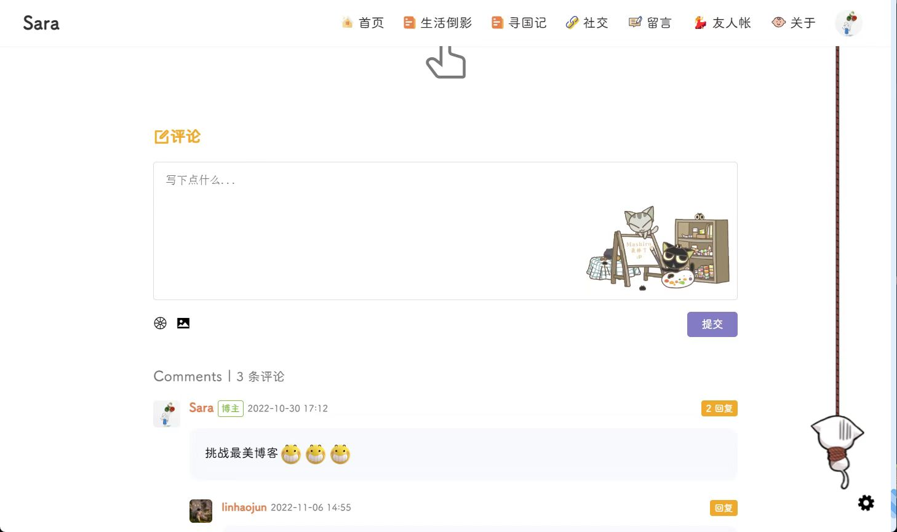
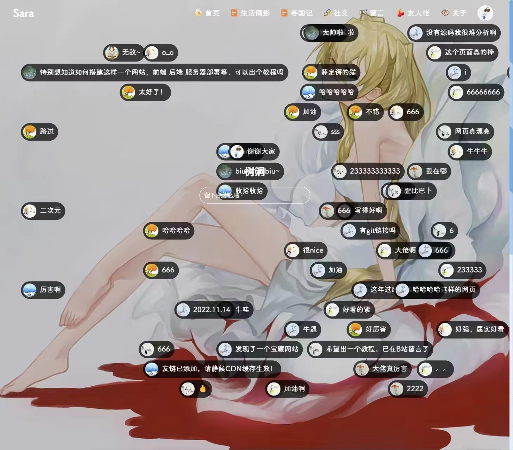
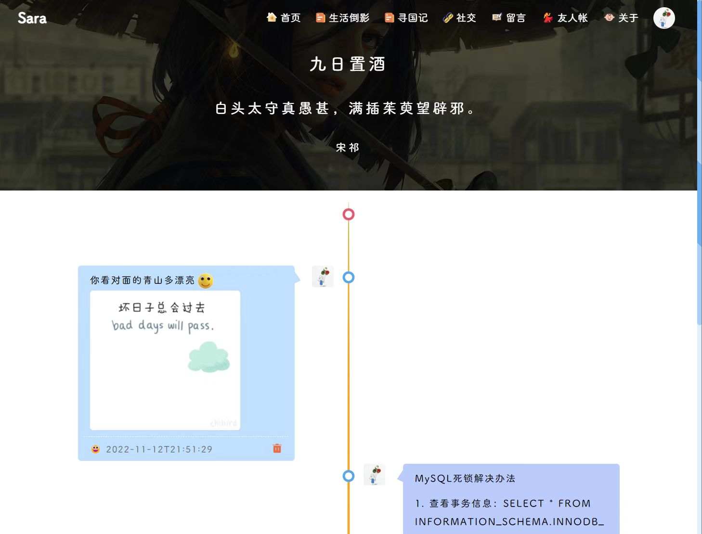
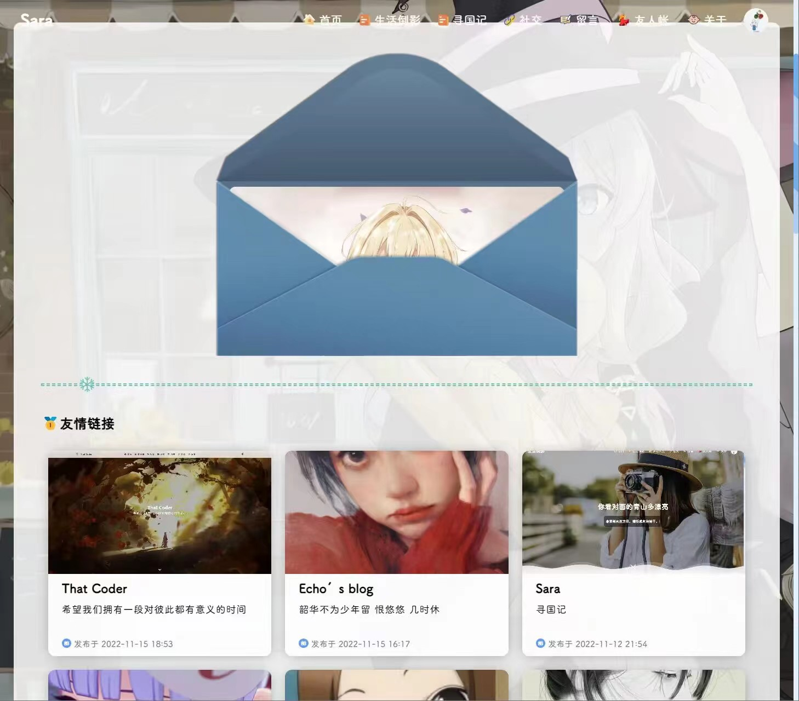
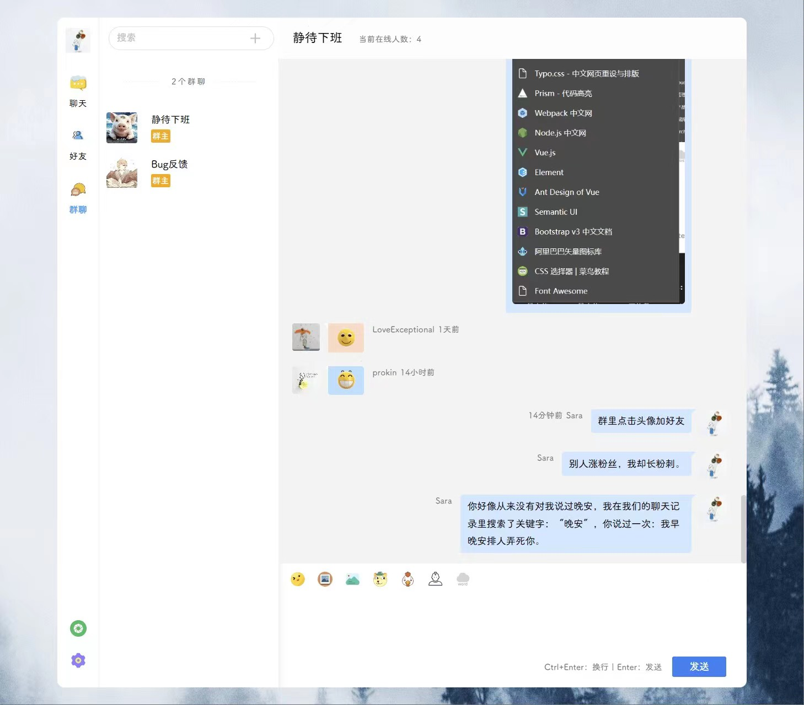

# Poetize（Vue2）

## 网站示例
[poetize.cn](https://poetize.cn)

## 技术栈
前端技术：Vue2（博客系统），Vue3（IM 聊天室系统），Element UI（Vue2），Element-Plus UI（Vue3），Naive UI（Vue3）

后端技术：Java，Spring Boot，spring-boot-starter-mail，Mysql，Mybatis-Plus，t-io，qiniu-java-sdk

## 网站简介
这是一个 Spring Boot + Vue2 + Vue3 的产物。

网站分两个模块：
- 博客系统：具有文章，留言，友链，时间线，后台管理等功能。
- 聊天室系统：具有朋友圈（时间线），好友，群等功能。

本网站搭建于阿里云，采用前后端分离进行实现，两个前端项目通过Nginx代理。

### 2023年1月1日更新
- 新增：音乐盒功能
- 新增：表白墙功能
- 优化：文件管理
- 优化：登录支持多端登录
- 优化：登录权限过期时间重置
- 优化：前端美化
- 优化：留言分类与资源整合

### 2023年4月1日更新
- 新增：百宝箱（收藏夹）
- 优化：首页
- 优化：前端美化
- 优化：资源整合

### 2023年7月20日更新
- 新增：旅拍模块
- 新增：看板娘
- 优化：聊天室脚本过滤
- 优化：每个IP和账号限制每天接口保存次数
- 优化：Bug修复

### 2023年8月20日更新
- 新增：访客统计（博客首页展示总访问量，后台管理系统首页展示IP/地区/用户维度的访问统计）
- 新增：搜索（标题与内容匹配。标题匹配放在上面，内容匹配放在下面。匹配多个标题或者多个内容时间倒叙排列）
- 新增：音乐按照列表顺序播放，列表中最后一首歌播放完后停止
- 新增：聊天室搜索功能（搜索框下的内容筛选）
- 新增：后台管理系统【欢迎光临】
- 优化：前端美化
- 优化：个别Bug修复

### 2023年9月1日更新：安全，安全，安全
- 优化：所有保存接口、邮件发送接口、文件上传接口都限制次数，防止恶意调用
- 优化：修复vuex中用户信息丢失错乱的Bug
- 优化：文件上传模块改造，每次上传之前获取上传密钥，每个密钥只能上传一个文件
- 优化：个别Bug修复

### 2023年10月1日更新
- 新增：文章加密
- 新增：文章订阅
- 新增：文件上传模块改造，支持多平台（目前对接本地）
- 优化：友人帐及其他模块样式调整

### 首页


### 推荐


### 留言


### 树洞


### 朋友圈（时间线）


### 友链


### 聊天室


## 安装
```
npm install
```

## 启动
```
npm run serve
```

## 编译
```
npm run build
```

## 配置
全局搜索：`$$$$`

替换成自己自定义的内容，因为Https无法跨域，这些内容需要用自己的。

- 博客：https://gitee.com/littledokey/poetize-vue2.git
- 聊天室：https://gitee.com/littledokey/poetize-im-vue3.git
- 后端：https://gitee.com/littledokey/poetize.git
- 部署文档：https://poetize.cn/article?id=26
- 七牛云登录/注册地址（文件服务器，CDN）：https://s.qiniu.com/Mz6Z32

### 重点事情说三遍
`Star`

`Star`

`Star`

一定要`Star`

注意：[poetize.cn](https://poetize.cn)可能会下线，也可能不会，看缘分吧。

## 欢迎进群（一定要Star）
1. 交流（摸鱼）
2. 安装部署：互相帮助，争取每个人都零基础拥有自己的个人网站
3. 博客答疑：每段代码都是我自己写的，爱学习的小伙伴可以在这里提问，互相学习，互相进步
4. 漏洞反馈：欢迎提交BUG
5. 迭代升级：欢迎提好的创意

群名片七天有效，如果需要请加作者好友（请务必Star，并注明来源），然后拉进交流群（请按需加群，有问题先看文档再咨询网友，退群后删除好友）。

目前（2023年8月10）群活跃度较高，群友们相互帮助，热心答疑。群友们制作了全流程源码部署教程详细文档、宝塔部署教程等，使得项目逐渐完善。

如果觉得群友对你有所帮助，请表达感谢，为营造群内良好氛围出一份力，谢谢。

希望大家一起让这个项目越来越好。


开源不易，欢迎赞助这个项目，让这个项目越来越好。

## 欢迎关注作者B站
B站搜索用户【寻国记】，博客介绍与搭建教程。

【挑战最美博客！个人博客网站食用教程。这是一个 SpringBoot 与 Vue 的产物，在此公开，一起学习，共同成长。】
https://www.bilibili.com/video/BV1eM41167Ks/?share_source=copy_web
